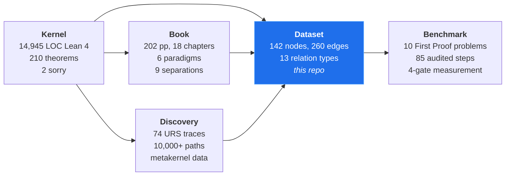
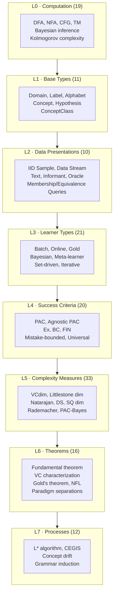
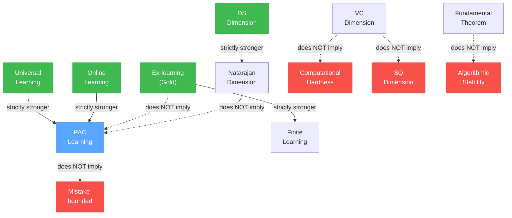
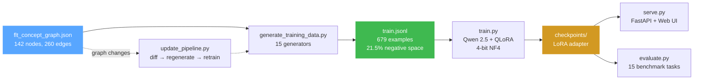

# Formal Learning Theory Dataset

**A machine-readable knowledge graph of formal learning theory with typed negative-space characterizations, benchmark tasks, and fine-tuning tools for domain-specialized language models**

[]()
[]()
[]()
[]()
[]()
[]()
[](LICENSE)

---

A concept graph is usually a record of what holds. This one also records what does not hold, and the witnesses that prove it.

The dataset encodes 142 concepts and 260 typed edges spanning six learning paradigms: PAC, online, Gold's identification-in-the-limit, universal learning, PAC-Bayes, and stability-based learning. Thirteen invertible relation types capture definitional dependencies, equivalence characterizations, upper and lower bounds, proof dependencies, instance hierarchies, and complexity measurements. So far, this is standard.

What is not standard: 50 items in this graph exist solely to record *negative* structure. Nine `does_not_imply` edges with explicit separation witnesses. Four `strictly_stronger` edges with witness constructions. Thirty-two analogy edges carrying typed obstruction fields that identify precisely *why* the analogy cannot be upgraded to a theorem. Two `requires_assumption` edges marking results that depend on cryptographic assumptions irreducible to P ≠ NP. Three scope-boundary nodes marking what is *explicitly excluded* and why.

The negative space is not a footnote. It is the architecture of the field. A concept class that is PAC learnable need not be online learnable (thresholds on ℝ: VCdim = 1, Ldim = ∞). A concept class identifiable in Gold's model need not be PAC learnable (finite subsets of ℕ: identifiable, VCdim = ∞). Finite Natarajan dimension does not imply multiclass PAC learnability (Brukhim et al. 2022: d_N = 1, not learnable). These separations define the field's joints. Without them, the six paradigms appear to be notational variants of the same idea. They are not. The witnesses prove it.

This repository provides the graph, a 15-task benchmark for evaluating structured reasoning over it, a fine-tuning pipeline targeting Qwen 2.5 for domain specialization, and the data infrastructure for a longer-term research goal: training a small language model to generate bridge lemmas for Lean 4 formalization of learning theory.

---

## Table of Contents

- [I. The Programme](#i-the-programme)
- [II. The Concept Graph](#ii-the-concept-graph)
- [III. The Negative Space](#iii-the-negative-space)
- [IV. The Typing Structure](#iv-the-typing-structure)
- [V. The Audit](#v-the-audit)
- [VI. The Benchmark](#vi-the-benchmark)
- [VII. Fine-Tuning Pipeline](#vii-fine-tuning-pipeline)
- [VIII. Bridge Lemma Discovery: The Open Problem](#viii-bridge-lemma-discovery-the-open-problem)
- [IX. Schema Reference](#ix-schema-reference)
- [X. Repository Structure](#x-repository-structure)
- [XI. Building and Usage](#xi-building-and-usage)
- [XII. License](#xii-license)
- [XIII. Citation](#xiii-citation)

---

## I. The Programme

This dataset is one component of a five-repository research programme that formalizes, analyzes, and stress-tests the structure of learning theory.



| Repository | What it is | Scale |
|------------|-----------|-------|
| [formal-learning-theory-kernel](https://github.com/Zetetic-Dhruv/formal-learning-theory-kernel) | Lean 4 formalization. 210 theorems. Fundamental theorem of statistical learning proved sorry-free (5-way equivalence). Found 5 false textbook assumptions and 3 irreducible type-theoretic fractures. | 14,945 LOC, 31 files |
| **formal-learning-theory-dataset** | Machine-readable concept graph + fine-tuning tools. **This repository.** | 142 nodes, 260 edges, 679 training examples |
| [formal-learning-theory-book](https://github.com/Zetetic-Dhruv/formal-learning-theory-book) | Textbook. Six paradigms, their characterization theorems, and the separations between them. | 202 pages, 18 chapters |
| [formal-learning-theory-discovery](https://github.com/Zetetic-Dhruv/formal-learning-theory-discovery) | Synthetic discovery analysis. URS traces, metakernel data, exploration paths from the formalization process. | 74 traces, 10,000+ paths |
| [First-Proof-Benchmark-Results](https://github.com/Zetetic-Dhruv/First-Proof-Benchmark-Results) | Empirical analysis of autonomous proof discovery on Harvard's First Proof benchmark. 98% inference validity, 69% generalization robustness. The 29-point gap is the core finding. | 10 problems, 85 audited steps |

The kernel produces theorems. The book presents them. The discovery repo records *how* they were found, including the dead ends. This dataset distills the typed structure into a machine-readable graph. The benchmark measures whether frontier models can reason over that structure. The flow is: formalize → discover → encode → evaluate → specialize.

---

## II. The Concept Graph

The graph contains 142 nodes (133 kernel, 6 deferred, 3 scope boundaries) and 260 directed edges across 13 typed, invertible relation types. Every node carries a formal definition, provenance, claim type (definition or theorem), and layer assignment. Every edge carries a relation type; edges of types `characterizes`, `does_not_imply`, `strictly_stronger`, `upper_bounds`, `lower_bounds`, `requires_assumption`, and `used_in_proof` are required to carry citations. Separation edges (`does_not_imply`, `strictly_stronger`) are required to carry explicit witness constructions.

### Layer Architecture

Nodes are organized into eight semantic layers. The layering reflects definitional dependency: layer $L_k$ nodes may depend on $L_j$ nodes only if $j \leq k$.



| Layer | Count | Primary categories | Role |
|-------|-------|--------------------|------|
| L0 | 19 | computation_model, formal_object | Automata, computability, Bayesian and information-theoretic primitives |
| L1 | 11 | base_type | Domain, Label, Concept, Hypothesis: the substrate all paradigms share |
| L2 | 10 | data_presentation | How data reaches the learner: i.i.d. samples, streams, oracles, queries |
| L3 | 21 | learner_type | What the learner is: batch, online, Gold, Bayesian, meta |
| L4 | 20 | success_criterion | What "learning" means: PAC, Ex, BC, mistake-bounded, universal |
| L5 | 33 | complexity_measure | What determines difficulty: VCdim, Ldim, SQdim, Rademacher, compression |
| L6 | 16 | characterization, impossibility | The theorems: equivalences, separations, lower bounds, NFL |
| L7 | 12 | process, scope_boundary | Algorithms and explicit exclusions |

### Node Categories

| Category | Count | Description |
|----------|-------|-------------|
| complexity_measure | 33 | VC dimension, Littlestone dimension, Natarajan, DS, SQ, Rademacher, PAC-Bayes, stability, info-theoretic, compression, growth function, fat-shattering, pseudodimension, ordinal dimensions, margin, star number |
| learner_type | 21 | Batch, online, Gold, Bayesian, meta-learner, iterative, set-driven, query, universal |
| success_criterion | 20 | PAC, agnostic, exact, Ex, BC, FIN, mistake-bounded, regret-bounded, universal, posterior consistency |
| characterization | 10 | VC characterization, fundamental theorem, Littlestone characterization, mind-change characterization, Occam, compression, universal trichotomy |
| formal_object | 12 | Version space, hypothesis sequence, mistake tree, Littlestone tree, growth function |
| data_presentation | 10 | IID sample, data stream, text, informant, membership query, equivalence query, statistical query |
| base_type | 10 | Domain, label, alphabet, concept, hypothesis, concept class, hypothesis space |
| process | 9 | L*, CEGIS, grammar induction, concept drift, inductive logic programming |
| impossibility | 6 | Gold's theorem, NFL, PAC lower bound, proper/improper separation, cryptographic hardness |
| model_selection | 4 | MDL, MML, SRM, algorithmic probability |
| computation_model | 3 | DFA, NFA, pushdown automaton |
| scope_boundary | 3 | Bandits, RL, quantum learning (explicit exclusions) |
| derived_type | 1 | Proper flag |

### Edge Distribution

| Relation | Count | Semantics |
|----------|-------|-----------|
| `defined_using` | 99 | X's definition directly invokes Y |
| `analogy` | 32 | Structural parallel, formally independent. All 32 carry obstruction fields. |
| `instance_of` | 25 | X is a specific instance/specialization of Y |
| `characterizes` | 24 | X ↔ Y: equivalence under stated conditions |
| `measures` | 22 | Complexity measure X quantifies property of Y |
| `used_in_proof` | 14 | Theorem X uses concept Y in its statement or proof |
| `does_not_imply` | 9 | X does NOT imply Y, with explicit witness |
| `extends_grammar` | 8 | X generalizes Y but required inventing new primitives |
| `restricts` | 8 | X generalizes Y by removing a constraint. No new grammar. |
| `upper_bounds` | 8 | X provides upper bound on Y |
| `lower_bounds` | 5 | X provides lower bound on Y |
| `strictly_stronger` | 4 | X ⊋ Y with known witness for separation |
| `requires_assumption` | 2 | X holds only if Y is assumed |

---

## III. The Negative Space

A field is not defined only by what holds. It is defined equally by what does not hold, and the witnesses that prove it.

The graph contains 50 negative-space items: 9 non-implications with witnesses, 4 strict-hierarchy separations with witnesses, 32 analogy obstructions classified by failure type, 2 conditional results requiring cryptographic assumptions, and 3 explicit scope exclusions. Together these constitute the *joint structure* of learning theory: the points where paradigms that appear related are proved to be fundamentally separated.

### The 13 Separation Witnesses

Each separation carries a constructive witness: a specific concept class or mathematical object that demonstrates the failure of implication. The witness is the mathematics; the statement is merely its summary.

#### Non-implications

| Source | Target | Witness | Citation |
|--------|--------|---------|----------|
| PAC learning | Mistake-bounded | Thresholds on ℝ: VCdim = 1, Ldim = ∞. PAC learnable but online-unlearnable. | Littlestone 1988 |
| Ex-learning | PAC learning | All finite subsets of ℕ: identifiable from text, but VCdim = ∞. | Gold 1967 |
| VC dimension | Computational hardness | Poly-size circuits under DCRA: finite VCdim, computationally hard to learn. | Kearns–Valiant 1994 |
| VC dimension | SQ dimension | Parities: VCdim = n, SQdim = 2^n. Exponential gap. | Blum–Furst–Jackson–Kearns–Mansour–Rudich 1994 |
| Proper/improper | PAC learning | 3-term DNF: NP-hard to learn properly, poly-time learnable improperly. | Pitt–Valiant 1988 |
| Unlabeled compression | Compression scheme | VC-2 class with no unlabeled compression of size 2. | Pálvölgyi–Tardos 2020 |
| Fundamental theorem | Algorithmic stability | Beyond binary 0-1 loss, uniform convergence does not imply learnability. | Shalev-Shwartz–Shamir 2010 |
| PAC learning | Exact learning | PAC allows approximation error ε; exact requires zero error. | Valiant 1984 |
| Natarajan dimension | PAC learning | Non-learnable class with Natarajan dimension 1 when \|Y\| = ∞. | Brukhim–Carmon–Dinur–Moran–Yehudayoff 2022 |

Consider the last row. For thirty years, the Natarajan dimension was treated as the multiclass analogue of VC dimension. Finite Natarajan dimension was believed to characterize multiclass PAC learnability, the way finite VC dimension characterizes binary learnability. It does not. Brukhim et al. (2022) constructed a concept class with Natarajan dimension 1 (the smallest possible non-trivial value) that is not PAC learnable when the label space is infinite. The correct multiclass characterization requires the DS dimension, a strictly stronger combinatorial parameter. The graph records both the failed conjecture (`natarajan_dimension --[does_not_imply]--> pac_learning`) and the correct characterization (`ds_dimension --[characterizes]--> pac_learning`).

#### Strict hierarchies

| Stronger | Weaker | Witness | Citation |
|----------|--------|---------|----------|
| Universal learning | PAC learning | Classes with infinite VCdim but no infinite Littlestone tree achieve exponential universal rates. | Bousquet–Hanneke–Moran–van Handel–Yehudayoff 2021 |
| Ex-learning | Finite learning | Classes requiring unbounded mind changes (pattern languages with growing complexity). | Gold 1967 |
| Online learning | PAC learning | Finite Ldim ⟹ finite VCdim. Thresholds on finite domains: Ldim = log(n), VCdim = 1. | Littlestone 1988 |
| DS dimension | Natarajan dimension | Hyperbolic pseudo-manifold construction. | Brukhim–Carmon–Dinur–Moran–Yehudayoff 2022 |

### The Separation Lattice



<sub>Green: source of strict implication. Blue: shared target. Red: non-implied target. Solid arrows: strict hierarchy (⊋). Dashed arrows: non-implication with witness.</sub>

### The Obstruction Taxonomy

All 32 analogy edges carry an `obstruction` field identifying what blocks formal upgrade, and an `obstruction_type` classifying the failure mode. The obstruction type is more informative than the analogy itself: it identifies the *kind* of wall between paradigms.

| Obstruction Type | Count | What blocks the analogy |
|------------------|-------|-------------------------|
| `type_mismatch` | 12 | The two concepts operate on incompatible types. No type-preserving map exists. |
| `missing_equivalence_witness` | 9 | The analogy is one-directional: A implies structural similarity to B, but no B → A witness is known. |
| `one_way_theorem_only` | 4 | A theorem connects A to B, but it is a one-way bound, not an equivalence. The converse is false or open. |
| `proof_method_mismatch` | 3 | The proofs on both sides use fundamentally incompatible methods (e.g., probabilistic vs. adversarial). |
| `data_model_mismatch` | 3 | The data presentations are incompatible: i.i.d. draws vs. adversarial sequences vs. text presentations. |
| `success_criterion_mismatch` | 1 | The success criteria differ in kind (approximate vs. exact, distributional vs. worst-case). |

The `type_mismatch` obstructions are the most structurally significant. They correspond directly to the three irreducible type-theoretic fractures discovered during Lean 4 formalization in the kernel:

1. **PAC vs. Online vs. Gold learner types have no common parent.** The data presentations are incompatible (i.i.d. sample vs. adversarial stream vs. text/informant), which forces incompatible learner signatures, which forces incompatible success criteria, which forces incompatible complexity measures. This is not a design choice. It is the mathematics.

2. **Finite dimensions (WithTop ℕ) vs. ordinal dimensions (Ordinal) cannot be unified.** VC dimension lives in ℕ ∪ {∞}. Ordinal VC dimension lives in the countable ordinals. The type systems are incompatible. Extending from finite to ordinal required new primitives, not merely removing constraints.

3. **MeasurableSet vs. NullMeasurableSet for uncountable concept classes.** The symmetrization proof of the fundamental theorem requires Tonelli interchange over concept classes. For uncountable classes, standard MeasurableSet blocks this interchange. NullMeasurableSet suffices. This discovery (kernel Session 7) resolved a 2-sorry block in the critical path.

### Scope Boundaries

Three nodes explicitly mark what the graph does *not* cover:

| Exclusion | Reason |
|-----------|--------|
| **Bandits** (EXP3, UCB) | Optimization/exploration framework, not classification. Different objective structure. |
| **Reinforcement learning** | Sequential decision-making with state transitions. Different problem structure (MDP, policy, value function). |
| **Quantum learning** | Quantum PAC learning and quantum query complexity exist but require quantum state/measurement primitives not present in classical learning theory. |

---

## IV. The Typing Structure

The 13 relation types are not an ad hoc taxonomy. Each has a formal inverse, enabling bidirectional graph traversal. Each has defined semantics constraining what it can connect. The vocabulary was designed to make the *kind* of relationship between concepts machine-readable, not merely the existence of a relationship.

### Relation Types with Inverses

| Relation | Inverse | Semantics | Required fields |
|----------|---------|-----------|-----------------|
| `defined_using` | `definition_of` | X's definition directly invokes Y. | - |
| `instance_of` | `has_instance` | X is a specific instance/specialization of Y. | - |
| `characterizes` | `characterized_by` | X ↔ Y: equivalence under stated conditions. | `citation` |
| `upper_bounds` | `bounded_above_by` | X provides upper bound on Y. | `citation` |
| `lower_bounds` | `bounded_below_by` | X provides lower bound on Y. | `citation` |
| `requires_assumption` | `assumed_by` | X holds only if Y is assumed. | `citation` |
| `strictly_stronger` | `strictly_weaker` | X ⊋ Y with known witness for separation. | `witness`, `citation` |
| `measures` | `measured_by` | Complexity measure X quantifies property of Y. | - |
| `analogy` | `analogy` | Structural parallel, formally independent. | - |
| `does_not_imply` | `not_implied_by` | X does NOT imply Y, with witness. | `witness`, `citation` |
| `used_in_proof` | `proves_about` | Theorem X uses concept Y in its proof. Distinct from `defined_using`. | `citation` |
| `restricts` | `restricted_from` | X generalizes Y by removing a constraint. No new grammar needed. | - |
| `extends_grammar` | `grammar_extended_by` | X generalizes Y but required inventing new primitives not present in Y. | - |

### The `extends_grammar` / `restricts` Distinction

The distinction between these two generalization types is a contribution of this dataset. Most knowledge graphs encode "generalizes" as a single relation. But there are two fundamentally different kinds of generalization:

**`restricts`**: X generalizes Y by removing a constraint, using the same formal vocabulary. NFA generalizes DFA by removing the determinism constraint. BC-learning generalizes Ex-learning by relaxing exact convergence to set-convergence. No new primitives are needed. The grammar is conserved.

**`extends_grammar`**: X generalizes Y but required inventing new concepts not present in Y. Pseudodimension extends VC dimension by adding witness thresholds for real-valued functions. Natarajan dimension extends VC dimension by adding multiclass shattering with two-coloring witnesses. Ordinal VC dimension extends VC dimension by replacing ℕ ∪ {∞} with countable ordinals. In each case, genuinely new primitives, not merely relaxed constraints, were required.

This distinction matters for proof discovery. A `restricts` generalization preserves the proof structure of the original (remove a hypothesis and check what survives). An `extends_grammar` generalization breaks the proof structure and requires new techniques. A bridge lemma generator must know which kind of gap it is facing.

---

## V. The Audit

The companion file `flt_commentary.json` records an independent audit of 67 edges. Eight issues were found. Each is precisely diagnosed with a specific fix.

| Edge | Issue Type | Diagnosis |
|------|-----------|-----------|
| `vc_dimension → computational_hardness` | Incorrect citation | Cites Vapnik–Chervonenkis 1971 (introduces VCdim). Should cite Kearns–Valiant 1994 (proves the separation). |
| `sq_dimension → vc_dimension` | Direction reversed | Edge says SQ ↛ VC, but note says VC ↛ SQ. The note and witness match each other. The edge direction is wrong. |
| `gold_theorem → pac_learning` | Semantic mismatch | Gold's theorem is an impossibility result, not a learnability assertion. Source should be `ex_learning`, not `gold_theorem`. |
| `computational_hardness → inductive_bias` | Target mismatch | Target `inductive_bias` does not match the note (cryptographic assumptions). No crypto-assumption node exists. |
| `meta_pac_bound → pac_learning` | Overstated relation | Claims `characterizes` (equivalence). Baxter 2000 provides a bound, not a characterization. Should be `restricts`. |
| `occam_algorithm → pac_learning` | Overstated relation | Claims full characterization. Converse (Board–Pitt 1990) holds only for polynomially closed classes. |
| `computational_hardness → sq_dimension` | Incorrect citation | Cites Kearns–Valiant 1994, which does not use SQ dimension. Should cite Kearns 1998 or Blum et al. 1994. |
| `online_pac_gold_separation → vc_characterization` | Incorrect citation | Cites Gold 1967, but the VC characterization was proved by Blumer et al. 1989. Gold does not discuss VC dimension. |

### Audit Summary by Relation Type

| Relation type | Audited | Clean | Issues |
|---------------|---------|-------|--------|
| `characterizes` | 28 | 26 | 2 (overstated equivalences) |
| `does_not_imply` | 9 | 6 | 3 (wrong citation, reversed direction, semantic mismatch) |
| `strictly_stronger` | 4 | 4 | 0 |
| `upper_bounds` | 8 | 8 | 0 |
| `lower_bounds` | 4 | 4 | 0 |
| `requires_assumption` | 2 | 1 | 1 (target mismatch) |
| `used_in_proof` | 12 | 10 | 2 (wrong citations) |

The audit does not soften its findings. The 8 issues are real errors, not edge cases. They are recorded with precise fixes so that downstream consumers (including fine-tuned models) can apply corrections.

---

## VI. The Benchmark

Fifteen structured tasks evaluate whether a system can reason over the graph via traversal, not memorization. Tasks span six types and three difficulty levels. Gold answers with scoring rubrics are provided in `flt_task_answers.json`.

### Task Design

Each task is a structured query answerable by graph traversal. The task specifies which edge types are used and what traversal method is required. This makes evaluation deterministic: a correct answer must match the graph structure, not paraphrase a textbook.

| ID | Type | Question (abbreviated) | Difficulty | Edge types used |
|----|------|----------------------|------------|-----------------|
| T01 | Prerequisite retrieval | What concepts must be defined before VC dimension? | Easy | `defined_using` |
| T02 | Characterization query | What are ALL known characterizations of PAC learnability? | Easy | `characterizes` |
| T03 | Non-implication query | Is a PAC-learnable class necessarily online-learnable? | Easy | `does_not_imply` |
| T04 | Bound comparison | What generalization bounds are available and what do they depend on? | Medium | `upper_bounds`, `defined_using` |
| T05 | Cross-paradigm reasoning | Can a Bayesian learner be PAC-Bayes analyzed for a multiclass problem where Natarajan dim is finite but the class is not learnable? | Hard | `instance_of`, `upper_bounds`, `does_not_imply`, `characterizes` |
| T06 | Hierarchy extraction | What is the strict power hierarchy among Gold success criteria? | Easy | `strictly_stronger` |
| T07 | Obstruction analysis | Why is the analogy between concept drift and online learning not a theorem? | Medium | `analogy` |
| T08 | Grammar expansion | Which generalizations of VCdim required new formal primitives? | Easy | `extends_grammar` |
| T09 | Computational barrier | What prevents efficient PAC learning even when VCdim is finite? | Medium | `requires_assumption`, `used_in_proof`, `does_not_imply` |
| T10 | Curriculum ordering | Generate a reading order for learning PAC theory from scratch. | Medium | `defined_using` |
| T11 | Scope boundary | Is reinforcement learning covered in this graph? | Easy | - |
| T12 | Separation retrieval | List all known separations between paradigms with witnesses. | Easy | `does_not_imply`, `strictly_stronger` |
| T13 | Complexity comparison | How do VCdim, Ldim, SQdim, and star number relate? | Hard | `upper_bounds`, `analogy`, `does_not_imply` |
| T14 | Real-valued extension | What changes from binary classification to real-valued prediction? | Medium | `extends_grammar`, `restricts`, `characterizes` |
| T15 | Multiclass analysis | Does the fundamental theorem extend to multiclass? | Hard | `characterizes`, `does_not_imply`, `extends_grammar` |

### Scoring

Three scoring methods match the three answer types:

| Method | Used by | How it works |
|--------|---------|--------------|
| `set_match` | T01, T02, T08 | Fraction of expected node set found in response. |
| `chain_match` | T06, T10 | Coverage × order correctness. Items must appear in correct relative order. |
| `structured_explanation` | T03–T05, T07, T09, T11–T15 | Required conceptual elements checked for presence. Each element is binary (present/absent). Score = fraction of elements found. |

The three hard tasks (T05, T13, T15) require combining multiple edge types across paradigms, the kind of multi-hop reasoning that benchmarks like these are designed to test, and that current models struggle with.

---

## VII. Fine-Tuning Pipeline

The repository includes a complete pipeline for fine-tuning Qwen 2.5 on the concept graph via QLoRA. The pipeline generates training data from the graph (covering both positive and negative space), trains with 4-bit quantization, serves via FastAPI with a web UI, evaluates against the benchmark, and supports incremental retraining when the graph expands.



### Quickstart

```bash
pip install -r requirements.txt

# 1. Generate training data from the graph
python scripts/generate_training_data.py \
    --graph dataset/flt_concept_graph.json \
    --output data/train.jsonl

# 2. Fine-tune Qwen 2.5 (requires GPU)
python scripts/train.py --config config/training_config.yaml

# 3. Evaluate against the benchmark
python scripts/evaluate.py \
    --model checkpoints/flt-qwen2.5-7b/final \
    --base-model Qwen/Qwen2.5-7B-Instruct

# 4. Serve with web UI
python scripts/serve.py \
    --model checkpoints/flt-qwen2.5-7b/final \
    --base-model Qwen/Qwen2.5-7B-Instruct \
    --load-4bit
```

### Training Data Composition

The data generator produces examples across 15 generator types. Negative-space generators are marked.

| Generator | Count | Space | What it produces |
|-----------|-------|-------|------------------|
| definition | 266 | Positive | "What is X?" → formal definition + provenance |
| prerequisite | 69 | Positive | "What must be defined before X?" → `defined_using` chain |
| characterization | 48 | Positive | "Does X characterize Y?" → equivalence with citation |
| bounds | 13 | Positive | "How do X and Y relate?" → upper/lower bound |
| hierarchy | 20 | Positive | Strict hierarchies, grammar extensions, constraint removals |
| proof_dependency | 14 | Positive | "What role does Y play in proving X?" |
| instance | 25 | Positive | "Is X an instance of Y?" |
| measures | 22 | Positive | "What does X measure?" |
| **non_implication** | **27** | **Negative** | "Does X imply Y?" → NO, with witness. 3 variants per edge. |
| **obstruction** | **64** | **Negative** | "Why isn't this analogy a theorem?" → obstruction analysis |
| **scope_boundary** | **3** | **Negative** | "Is X covered?" → explicit exclusion |
| **requires_assumption** | **2** | **Negative** | "What assumptions does X require?" |
| **negative_probe** | **50** | **Negative** | "Does X characterize Y?" → NO (absence-of-edge training) |
| multihop_prereq | 52 | Composite | Full dependency chains via BFS |
| paradigm_comparison | 4 | Composite | Cross-paradigm: what holds vs. what doesn't |

**Total: 679 examples. 533 positive/composite. 146 negative (21.5%).**

Negative probes (the last negative generator) are particularly important. They train the model to say "there is no known relationship" when the graph has no edge, rather than hallucinating one. This is the anti-confabulation mechanism.

### Model Configuration

The default configuration targets Qwen 2.5 7B Instruct with QLoRA:

| Parameter | Value |
|-----------|-------|
| Base model | `Qwen/Qwen2.5-7B-Instruct` |
| LoRA rank | 32 |
| LoRA alpha | 64 |
| Target modules | q_proj, k_proj, v_proj, o_proj, gate_proj, up_proj, down_proj |
| Quantization | 4-bit NF4 with double quantization |
| Effective batch size | 16 (4 × 4 gradient accumulation) |
| Learning rate | 2e-5, cosine schedule |
| Epochs | 5 |
| Max sequence length | 2048 |

Adjust `base_model` in `config/training_config.yaml` for different scales:
- `Qwen/Qwen2.5-1.5B-Instruct`: ~8 GB VRAM
- `Qwen/Qwen2.5-7B-Instruct`: ~16 GB VRAM
- `Qwen/Qwen2.5-14B-Instruct`: ~40 GB VRAM

### Update Pipeline

The knowledge base is designed to expand. The kernel currently contains 210 theorems; the formalization is ongoing. When new nodes and edges are added to the graph:

```bash
# See what changed since last training
python scripts/update_pipeline.py --diff

# Regenerate training data only (inspect before retraining)
python scripts/update_pipeline.py --data-only

# Full update: regenerate + retrain
python scripts/update_pipeline.py --full
```

The pipeline diffs against a snapshot of the last-trained graph, reports new nodes, new edges, removed nodes, and modified nodes, then regenerates all training data. State is tracked in `data/update_state.json`.

---

## VIII. Bridge Lemma Discovery: The Open Problem

This dataset was built to support a specific research question: **can a small language model learn to generate bridge lemmas for formal proofs in learning theory?**

### The empirical motivation

The [First Proof Benchmark Results](https://github.com/Zetetic-Dhruv/First-Proof-Benchmark-Results) tested autonomous proof discovery on 10 open research-level mathematics problems. The core finding: 98% inference validity but only 69% generalization robustness, a 29-point gap. The model rarely produces invalid mathematics. It fails when a locally valid argument does not survive transport to the full target.

The most common failure mode is case enumeration instead of generalization. Given a sorry hole between known atoms A and B, frontier models prove the bridge for n = 1, n = 2, n = 3, and leave the task incomplete. They do not propose the ∀n statement. The atoms are known. The types are known. The general connecting statement, the bridge lemma, is what the model cannot construct.

### Two kinds of generalization failure

The First Proof analysis identifies two distinct types:

1. **Open-ended abstraction.** The ignorance state is diffuse. No single bridge is identified. The system cannot construct a new coordinate system. These failures are structurally intractable for current methods.

2. **Bridge creation over known atoms.** The ignorance state is well-characterized. The gap is precise. The missing piece is a specific lemma connecting a known local result to the target, staying within the established type vocabulary. These failures are structurally tractable.

This dataset targets type 2. The concept graph provides the atoms and their types. The kernel provides ground-truth bridges (every intermediate lemma in a proof chain is a bridge). The discovery repo provides exploration trajectories including failed bridge attempts.

### What a bridge lemma generator would do

Given a Lean 4 proof with a `sorry`:

1. **Traverse the type DAG** (the kernel's learning theory DAG + the reachable mathlib subgraph) to identify what is available in-premise.
2. **Propose a bridge** as a typed graph edge: source atom, target atom, relation type, and a natural-language statement precise enough to formalize.
3. **Output in dual format**: a Lean 4 type signature (machine-verifiable) and a JSON graph edge (human/agent-parsable).

This solves two failure modes simultaneously. **Transport failure** (the proposed lemma uses types or premises not available in the current context) is prevented by DAG traversal, because the model knows what is reachable. **Mathlib anxiety** (the agent cannot find the right mathlib lemma) is prevented by the same mechanism: the model searches the type-theoretic DAG, not a text index.

### What remains to be built

The current repository provides the atoms and the evaluation infrastructure. What is not yet built:

- **Bridge extraction from the kernel.** The 210 theorems contain ground-truth bridge chains. These need to be extracted as structured (sorry_context, failed_attempts, ground_truth_bridge) triples.
- **Lean type DAG integration.** The reachable mathlib subgraph for the kernel's imports needs to be computed and embedded.
- **Reward signal.** Lean type-checking provides binary pass/fail verification of proposed bridges. This enables RL or rejection sampling on top of supervised fine-tuning.
- **Evaluation protocol.** The current 15-task benchmark evaluates graph reasoning, not bridge generation. A bridge-specific benchmark is needed.

The question is whether 600–1000 ground-truth bridges from a 210-theorem kernel, augmented with 10,000+ exploration paths (including failures), are sufficient training signal for a 7B model to learn the bridge-generation skill in a non-trivial domain. This is an open empirical question. The dataset and tools in this repository are the infrastructure for answering it.

---

## IX. Schema Reference

### Node Schema

| Field | Required | Type | Description |
|-------|----------|------|-------------|
| `id` | ✓ | string | Unique snake_case identifier |
| `name` | ✓ | string | Human-readable name |
| `category` | ✓ | enum | One of: `base_type`, `derived_type`, `data_presentation`, `learner_type`, `success_criterion`, `complexity_measure`, `characterization`, `impossibility`, `formal_object`, `process`, `computation_model`, `model_selection`, `scope_boundary` |
| `layer` | ✓ | int (0–7) | Semantic layer |
| `status` | ✓ | enum | `defined`, `proved`, `deferred`, `scope_note` |
| `claim_type` | ✓ | enum | `definition` or `theorem` |
| `description` | ✓ | string | Full description including formal content |
| `formal_definition` | ✓ | string | Formal mathematical definition |
| `bib_keys` | - | string[] | Bibliography keys |
| `provenance` | - | object | `{introduced_by, year, note}` or `{proved_by, ...}` or `{field_origin}` |
| `key_theorems` | - | string[] | Major results about this concept |
| `open_problems` | - | string[] | Known open problems |
| `scope_note` | - | string | How this concept extends beyond the primary scope |
| `connections` | - | string[] | Informal cross-references |

### Edge Schema

| Field | Required | Type | Description |
|-------|----------|------|-------------|
| `source` | ✓ | string | Source node `id` |
| `target` | ✓ | string | Target node `id` |
| `relation` | ✓ | enum | One of the 13 relation types |
| `citation` | conditional | string | Required for `characterizes`, `does_not_imply`, `strictly_stronger`, `upper_bounds`, `lower_bounds`, `requires_assumption`, `used_in_proof` |
| `witness` | conditional | string | Required for `does_not_imply`, `strictly_stronger` |
| `note` | - | string | Explanation of the relationship |
| `edge_level` | - | string | `conceptual` or `claim` |
| `obstruction` | - | string | What blocks formal upgrade (for `analogy` edges) |
| `obstruction_type` | - | enum | `type_mismatch`, `missing_equivalence_witness`, `one_way_theorem_only`, `proof_method_mismatch`, `data_model_mismatch`, `success_criterion_mismatch` |
| `generalization_type` | - | string | For `restricts` and `extends_grammar` edges |

---

## X. Repository Structure

```
formal-learning-theory-dataset/
├── README.md
├── LICENSE
├── requirements.txt
├── .gitignore
│
├── dataset/
│   ├── flt_concept_graph.json              # The concept graph (142 nodes, 260 edges)
│   ├── flt_commentary.json                 # Audit: 67 edges checked, 8 issues found
│   ├── flt_tasks.json                      # 15 benchmark tasks
│   ├── flt_task_answers.json               # Gold answers with scoring rubrics
│   ├── TASK_URS_STATE.json                 # Textbook planning metadata (URS traces)
│   ├── TYPE_DERIVATION_STATE.json          # Lean 4 formalization state (v1)
│   └── TYPE_DERIVATION_STATE_v2.json       # Lean 4 formalization state (v2, sorry-free critical path)
│
├── config/
│   └── training_config.yaml                # Qwen 2.5 + QLoRA hyperparameters
│
├── scripts/
│   ├── generate_training_data.py           # Graph → JSONL (15 generators, positive + negative)
│   ├── train.py                            # QLoRA fine-tuning
│   ├── serve.py                            # FastAPI inference server + graph API
│   ├── evaluate.py                         # Benchmark evaluation with 3 scoring methods
│   └── update_pipeline.py                  # Change detection + incremental retraining
│
└── app/
    └── templates/
        └── index.html                      # Web UI: concept browser + chat
```

---

## XI. Building and Usage

### Requirements

- Python ≥ 3.10
- PyTorch ≥ 2.1 with CUDA (for training and GPU inference)
- 16 GB VRAM minimum for Qwen 2.5 7B with 4-bit quantization

```bash
pip install -r requirements.txt
```

### Generate Training Data (no GPU required)

```bash
python scripts/generate_training_data.py
```

Produces `data/train.jsonl` (679 examples). Inspect the output:

```bash
head -5 data/train.jsonl | python -m json.tool
```

### Train

```bash
python scripts/train.py --config config/training_config.yaml
```

### Evaluate

```bash
python scripts/evaluate.py \
    --model checkpoints/flt-qwen2.5-7b/final \
    --base-model Qwen/Qwen2.5-7B-Instruct \
    --output eval_results.json
```

### Serve

```bash
python scripts/serve.py \
    --model checkpoints/flt-qwen2.5-7b/final \
    --base-model Qwen/Qwen2.5-7B-Instruct \
    --load-4bit \
    --port 8000
```

Open `http://localhost:8000` for the web UI.

---

## XII. License

Apache 2.0. See [LICENSE](LICENSE).

---

## XIII. Citation

```bibtex
@misc{flt_dataset,
  title        = {Formal Learning Theory Dataset: Concept Graph, Negative-Space
                  Characterizations, and Fine-Tuning Tools},
  author       = {Gupta, Dhruv},
  year         = {2026},
  howpublished = {\url{https://github.com/Zetetic-Dhruv/formal-learning-theory-dataset}},
  note         = {142-node concept graph with 13 typed relation types, 13 separation
                  witnesses, 32 obstruction-bearing analogies, 15 benchmark tasks, and
                  QLoRA fine-tuning pipeline for Qwen 2.5. Part of a five-repository
                  programme formalizing learning theory in Lean 4.}
}
```

### Companion repositories

```bibtex
@misc{flt_kernel,
  title        = {Formal(ized) Learning Theory},
  author       = {Gupta, Dhruv},
  year         = {2026},
  howpublished = {\url{https://github.com/Zetetic-Dhruv/formal-learning-theory-kernel}},
  note         = {14,945 LOC Lean 4. 210 theorems. Fundamental theorem of statistical
                  learning proved sorry-free.}
}

@misc{flt_book,
  title        = {A Textbook of Formal Learning Theory},
  author       = {Gupta, Dhruv},
  year         = {2026},
  howpublished = {\url{https://github.com/Zetetic-Dhruv/formal-learning-theory-book}},
  note         = {202 pages, 18 chapters, 6 paradigms, 9 separation results.}
}

@misc{first_proof_results,
  title        = {First Proof Benchmark Results: Autonomous Proof Discovery Pilot},
  author       = {Gupta, Dhruv and Samanway},
  year         = {2026},
  howpublished = {\url{https://github.com/Zetetic-Dhruv/First-Proof-Benchmark-Results}},
  note         = {10 problems, 85 audited steps, 98\% inference validity,
                  69\% generalization robustness.}
}
```
